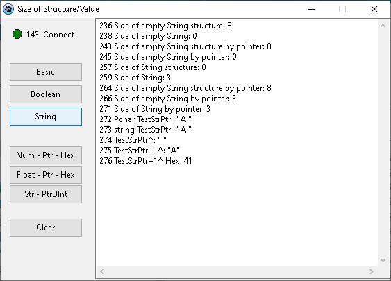

# SizeOfStructureAndValue
Size Of Structure And Value

Kerword:
  - Size of structure
  - Size of value
  - Size of structure using pointer
  - Size of value using pointer
  - Float to string:
    - FloatToStr(F)
    - Str(F:0:2, s);
    - FormatFloat('#.##', F)
    - FormatFloat('0.00', F, FS)
  
 

Related repositories
  - https://github.com/DavidTh30/LogMessageUsingConsole20Line
